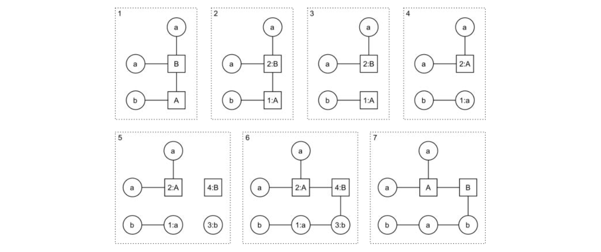

## 4. 以圖狀語法生成任務 (Graph Grammars to Generate Mission)

圖狀語法在 David Adams 的 2002 年學士論文— Automatic Generation of Dungeons for Computer Games 中討論關於關卡生成 [17]。圖狀語法是生成語法的一種特殊形式，它不產生字串，而是由邊與點所組成的圖形。在圖形語法中，一個或多個節點以及相連邊可以由節點與邊所產生的新結構給替代 [18]（請見圖二與圖三）。經過特定的規則所描述，將一組節點被選擇所替換之後，根據**規則左側**對所選擇的節點進行編號（圖三的第 2 步驟）。接下來，所有的被選擇的節點之間的邊將其移除（第 3 步驟）。有編號的節點接下來被取代成**規則右側**的等價節點（相同編號之節點）（第 4 步驟）。然後將**規則右側**中沒有與**規則左側**等價的節點添加至圖中（第 5 步驟）。最後，連接新節點的邊依**規則右側**放入圖中（第 6 步驟），以及移除編號（第 7 步驟）。請注意，圖狀語法可具有允許刪除現有節點的操作，但這些操作在本文中不被使用。

圖狀語法非常適合生成任務，因為任務相當適合以非線性圖來表示。它會需要一個由不同的任務所組成的字母表，其中包括了挑戰與獎勵。圖四表明了一些規則，用於生成與 *Forest Temple* 任務類似的任務結構。圖五為生成語法的範例輸出。請注意，該語法包括了兩種類型的邊，一為單箭頭、二為雙箭頭，不同類型的邊是一項能夠在其它圖狀語法中找到的特徵。在這裡的情況，雙邊表示在從屬節點與其上級節點**緊密耦合 (tight coupling)**：這意味著從屬節點必須放置在生成空間中的上級節點之後，針對本文所描述的來具體實行。一般邊表示**鬆散耦合 (loose coupling)**，並代表從屬節點可以被放置在任何一處。這對於生成空間的演算法來說非常重要（詳見下面第六章）。

