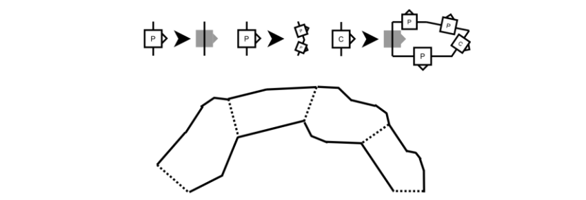

## 5. 以形狀語法生成空間 (Shape Grammar to Generate Space)

**形狀語法 (Shpae Grammars)** 對於生成空間是最有用的，形狀語法自 1970 年初，首次被 George Stiny 與 James Gips 所形容[19]。形狀語法以新的形狀作替代，而新形狀是利用類似生成語法與圖狀語法經過重寫規則後所產生。**特殊標記 (special markers)** 用於識別起始點、幫助定位（有時是縮放）新的形狀。

舉例來說，想像一形狀語法的字母表包含了三種符號：「a wall」、「open space」與「connection」（請見圖六-a）。在這一語法中，**僅有「connection」是非終端符號**，其帶有指向性三角形的正方形標記。此處表示形狀語法**規則右側**的灰色標記，表示了原始形狀的位置與其指向為何。我們可以設計一些規則，讓 connection 會被取代成一小段的通道、T 字叉路或是牆壁來替換，進而有效地關閉 connection（請見圖六-b）。顯而易見的是，圖六-c 中所描述的結構便是上述規則可能的產出，只要起始符號也是 connection，並假設在每次的迭代時選擇隨機的 connection 來替代。

形狀語法像是任何的生成語法，可以包括遞迴。遞迴為結果的形狀中，引入了更多變化的好方法。舉例來說，再圖七中的規則是具遞迴性，以及這些規則產生出的形狀更具有自然（**碎形 fractal**）的感覺。在這種情形下，語法的實現應該允許**規則右側**在被調整大小之時，以匹配的形狀大小進行增長。

