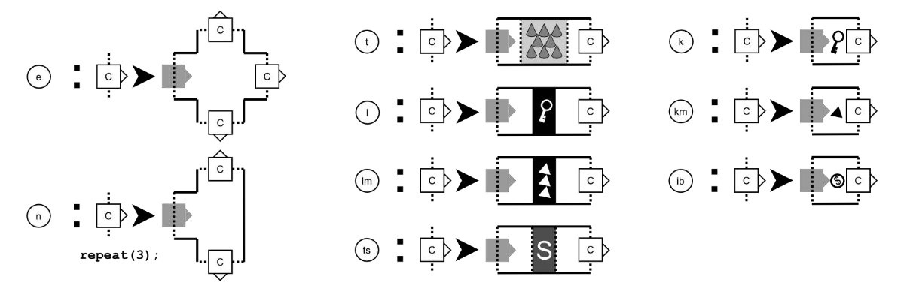

## 6. 由任務產生空間 (Generating Space From Mission)

為了從已生成的任務中使用形狀語法(Shape grammar)產生出一個空間，我們對形狀語法(Shape grammar)做了些微的調整。任務的中止符(Terminal symbols)必須在形狀語法中作為建造指令(Building instruction)發揮作用。為了實現任務中止符在形狀語法中的機能，形狀語法的每個規則都得與任務語法的中止符有所關連。形狀語法首先會搜索任務中的下一個符號，接著尋找可實現此符號的規則並基於它們的關聯權重(Relative weight)隨機挑選一個規則；然後從可適用此規則的各種可能擺設位置中再根據關聯適用度(Relative fitness，該位置可能有其他更合適的選擇)隨機選擇其一。當每個任務符號的元素被生成後，這個演算法會儲存一個參照(Reference)至其之中，這讓演算法可實作出由任務控制的緊耦合(tight coupling)。此機制避免演算法把鑰匙、道具隨機擺放而非如任務規範地安排在測驗、門鎖其後。形狀語法更針對一些影響規則選擇的動態參數做了擴充。這些參數用於建立程序化難易度或是在不同註記(Register)之間的切換。舉例來說，這個語法在每次選擇規則時有更高的機率選擇更困難的阻礙，並將生成許多陷阱的註記替換為存在與多怪物的註記。

在應證此研究的測試程式裡，規則可以擁有與它們對應的指令。這些指令在規則被使用的前後皆可執行。它們促使動態的規則權重與程序化難易度等。

有關於形狀語法的額外補充是，此形狀語法靈感來自於可自動鋪設交叉口道路的L-System(請見Section 3)。為了保證空間成長時確實能與先前已生成的空間重新連結，因此演算法需要加入一個步驟。該步驟執行於一個已擺放於空間的規則之後，它會尋找兩個鄰近且能適當對齊的connection，並將兩個空間連結起來。為了避免任務出現短迴路，例如將最終房間與入口附近的房間意外地連結起來，所有在生成結構中開放的connection都必須在特定的規則執行前或後封閉。這些指令對應到以實作此類邏輯的規則。

一旦完整的任務都被考慮過以後，形狀語法便退回正常的實作，且會繼續迭代直到所有非中止符被一套可完善此空間的規則(或說增長出額外分支)取代為中止符時。

圖 8列出形狀語法根據此方法而產生出的一些規則。圖 9展示出基於文上圖 5所示的任務第一部分的關卡結構的一些迭代。理論上要產生一個可以容納複數個任務並不會很困難。多個任務可以混合使用，透過生產器在多個任務中選擇下個被配置到地圖的工作。換而言之，第二個任務也可以在第一個任務預備後，被當作建造指令使用。
