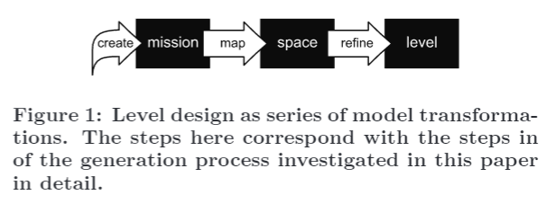
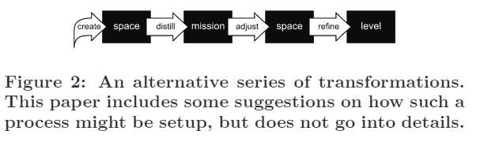

## 2. 任務與空間 (Mission and Space)

模型驅動在有適合的模型可用時，便可應用於關卡設計。在先前的研究中，我對關卡任務和關卡空間提出了兩個不同的模型，使關卡方便以不同的步驟自動化生成 [9]。關卡任務代表玩家需要按照任務流程，來依序挑戰才能完成該關卡。一個關卡的空間由它的地理布局組成，或者由地圖呈現，或者由非常像地圖的節點網絡所組成。作者認為*一個完整的關卡需要包含空間和任務*；完整的關卡需要有一個特定的空間布局，和一系列需要在此空間執行的任務。

關卡設計的實作在理論上不該將任務從空間中分離開。因此，由幾位作者所提出的關卡設計布局的類型是相當矛盾的，有時令人困惑。由 Marie-Laure Ryan 所提出，最完整的**類型學 (typologies)** 之一 [15]，她的重點更側重於互動敘事而不是遊戲，她的範疇大多與適合任務的**拓樸結構(topological con-structions)** 緊密相關：「**故事樹 (story trees)**」、「**編織情節 (braided plots)**」、「**直接的網絡 (directed networks)**」、「**支線的引導 (vectors with side-branches)**」。但她也提到些明顯是空間結構的「迷宮」和「故事世界」。Ernest Adams 和 Andrew Rollings 的類別首先提到空間結構，但他們的範疇是利用不同的策略去促使玩家經由關卡來進步，在這種情況下使他們更能接近任務。

任務和空間的混亂常常導致關卡設計者採取簡單，但是有效的策略：使任務與空間**同構(isomorphic)**。雖然這對於某些遊戲是非常適合的，特別是對於一個具有線性的關卡設計，當然，這並不是唯一的選擇。把空間與關卡分離開讓遊戲有更豐富的關卡設計策略。舉例來說，遊戲可能會為了不同的任務而重複使用相同的空間，像是在 *System Shock II（網路奇兵2）*中，玩家多次穿梭宇宙飛船的相同區域。在 *System Shock II* 這款遊戲中充分表現出相同的空間可以容納不同的任務（假設單個任務結構彼此不太相似）。以這種重複使用空間的方式是非常實惠的：開發者不必為遊戲的每個任務而創造新的空間。這種做法也有玩家在遊玩時的好處，舉例來說，玩家可以利用先前地圖的知識，以增加玩家的**主體支配感 (sence of agency)** 與遊玩深度。我將在下面論證，對於動作冒險遊戲，從空間中分離任務也是一個有用的策略，因為它允許我們去設計或者是生成一個線性較低的關卡，並強調玩家成長的經驗。

在 [9] 先前提到的自動化關卡生成過程，我提出了一種自動關卡設計的方法藉由產生一個任務，然後使用這個任務去產生一個適合此任務的空間。可以想像，關卡設計者也能使用這種方法。他們可能首先通過生成任務的列表來創建任務，玩家必須執行這些任務才能完成關卡，接下來他們把任務轉變為空間，藉由重新安排任務在關卡的地圖上。設計者接著在地圖添加細節內容，直到該地圖充分塞滿任務要素並以做為遊戲關卡（參見圖一）。

如上述之任務與空間，每一個都呈現了關卡的不同面貌；每個要素都凸顯了同一關卡的不同結構品質。**任務圖 (mission graph)** 注重於任務與玩家的相互關係，而**空間圖 (space graph)** 代表了關卡的空間結構。通常，後者是更加複雜與詳盡；若有足夠的內容可以假設任務被嵌在空間圖之中，而不是相反過來。同樣的原因，當設計一個關卡時，首先設計任務通常比較簡單，然後設計一個空間來容納它。或者，設計者可以先設計一個空間，然後設計一個與空間相匹配的任務，或者在添加細節內容之前進行一些調整，使匹配任務更為便利（參見圖2）。這種方法更適合讓空間按照一些邏輯的架構來生成關卡：首先關卡可能是一個礦井，提供所有玩家期望從這類環境得到的所有元素，並可建構出一個符合該任務的環境。這樣一來，同一個空間也可以承載多個任務，如在 *System Shock II* 中的情況，其中玩家穿過太空船的甲板，並且在遊戲的後期階段返回先前所探索過的甲板。本篇論文主要專注在第一項，更簡單的策略。
