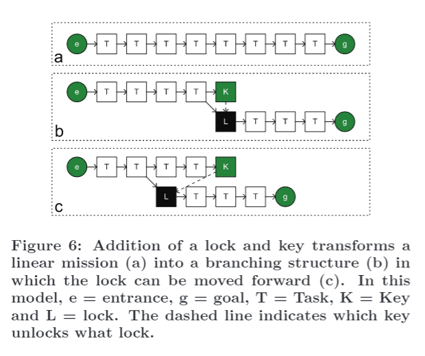
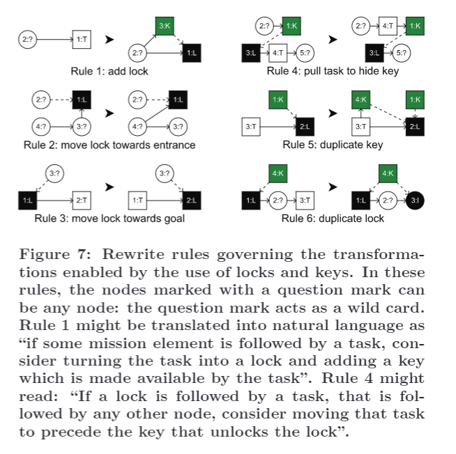
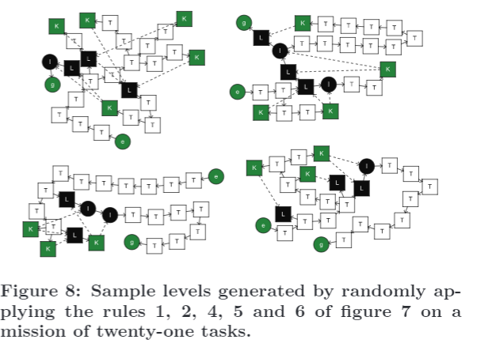

4.範例轉換:鎖與鑰匙

**複寫系統 (Rewrite systems) **可以被用於編制關卡設計原則。舉例來說，可以設計一個**複寫系統**，實踐在動作冒險遊戲中常見的典型的鎖和鑰匙結構(參見 [2])。鎖和鑰匙是使用**複寫系統**的技術的重要例證，不僅是因為鎖與鑰匙代表動作冒險遊戲的常見機制，而是因為它們在特定關卡任務中扮演著至關重要的角色被用來轉換為更像一個關卡空間的結構。

鎖跟鑰匙可以是字面上的鎖跟鑰匙，但他們相當普遍被用來偽裝成不同的項目。舉例來說，*The Legend of Zelda: Twilight Princess* 的玩家發現在*The Legend of Zelda: Twilight Princess* 的第一個地下城關卡中的武器跟鑰匙可以被用於不同的地方。它們有能力促使開關操作藉由風。遊戲的主角 Link 需要操作這些開關，以控制幾個轉彎的橋樑，讓他可以前往新的區域。為了得到可以解鎖最後魔王房間的鑰匙，主角必須使用迴力鏢去依正確的順序觸發四個開關。同時，迴旋鏢可以用來收集遠距離的道具 (這些道具可以用來獲得小物品和其他的道具），也可以作為武器使用。這允許設計者將任務的後半部分的元素 (在守護迴力鏢的小魔王被擊敗之後)放置在用於任務的前半部分的相同空間中。這意味著玩家最初會碰到他們無法克服的障礙，直到他們找到正確的“關鍵”。通常最好在鑰匙之前有這樣的鎖，有三個原因:
(1) 當鑰匙一開始被玩家找到，玩家將被迫收集他們遇到的道具而不加區分，這就造成了相當簡單的遊戲。
(2) 有障礙物和物品作為鎖和鑰匙，但用別的東西呈現，使玩家更容易識別鑰匙。如果玩家知道鎖是什麼，玩家們就可以了解何處是他們該前進的道路；他們將會主動規劃如何返回鎖所在之處的想法。
(3) 當玩家可以快速通過他們以前不能快速通過的障礙，他們將體會到進步與成就感。

鎖與鑰匙可以讓設計師去做一個線性系列的任務，這本身就會產生一個同等的線性關卡，並將其轉換為一個分支結構（見圖6）。這個轉換可以被捕捉到藉由利用 2種複寫規則（參見 圖7中的規則1和2）。這一步驟是重要的：任務的線性列表很容易凸顯出來，但是當直接映射到空間時，它不一定是一個有趣的關卡。
鎖與鑰匙的分支作為一定程度的非線性。特別是當鎖需要多個鑰匙時，他代表玩家可以依照任意順序去完成任務。

有很多規則可以被加到基礎設定中，以生成更有趣的關卡。舉例來說，一個規則可以用來使一個鎖向目標移動（參見圖7中的規則3），然而，這個規則打破了關卡設計智慧 (讓玩家在發現鑰匙之前，先碰到鎖)。另一個規則是用來把鑰匙放在一系列的任務中，在遇到鎖之前。這將有效地隱藏鑰匙，確保玩家需要完成許多任務在找到鑰匙之前。其他規則包含使用多個鑰匙來做為一個鎖的開啟條件(規則5)，或者是創造多次使用的鑰匙 (萬能鑰匙)（請參見規則6）。注意在最後一個例子中，**額外鎖(extra lock)** 是 **終端鎖(terminal lock)**，這意味這他不能依照規則2來移動。圖8顯示了一些使用 **複寫系統** 的關卡結構例子。

使用 **複寫系統** 的技術是有高度可控性的。如果您將鎖和鑰匙組合視為單個任務，則這些規則都不會更改關卡中的任務數。這樣，關卡的大小由初始任務的長度決定。除此之外，這些規則還確保一個鎖始終被另一個元素跟隨。這可以通過調查規則來驗證：沒有一個規則允許在鎖之後的最後一個節點移動，創建的所有附加分支結束在可以讓你去其他地方的鑰匙節點。這意味著所有任務必須被完成為了通過這個關卡。這也是在圖7中的規則6的第二個鎖被作為一個無法被移動的終端節點一個原因。如果可以移動，這將使在第一個門後的任務不在需要被用來完成關卡。
一旦生成了具有許多鎖和鑰匙的任務結構，就有幾種策略可以建構空間去符合這個任務的的所需環境。在先前的報告[9]，我描述了一種使用 **形狀語法(shape grammar)**[20]來定義空間部分的方法，這種空間方法被用來建構空間，這與拼圖由不同。雖然使用這種方法實作，但他難以產生一個任務空間用來使多條路徑匯聚成同個目標。為了解決這個問題，我利用了圖形的二維表示的空間特性，使其可以容易地轉換成形狀。 這種方法在[3]中概述。
