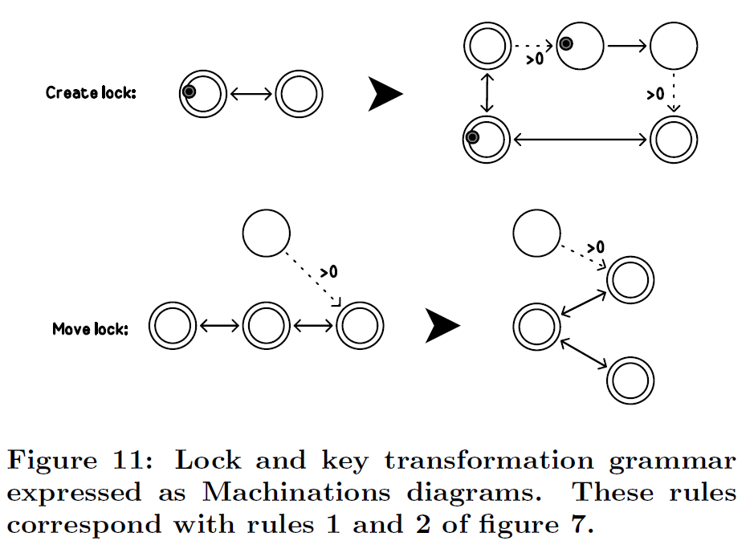

## 5. 生成的機制（Generating Mechanics）

遊戲關卡生成的過程也可以擴展到遊戲機制，會需要使用**圖 (graph)** 的結構來表示遊戲機制。Machinations 框架 [8] 提供了這樣的框架，Machinations 流程圖已經被用於表示遊戲當中的內部經濟。他們模擬在**池 (pools)**（開放的圓形元素）上收集**資源 (resources)**（小型的彩色圓圈），池可能是被動或是互動式的。互動式的池以雙輪廓表示，並且可以透過某些玩家的動作來激活。箭頭表示資源如何在流程圖上流動，與**配特里網 (Petri-nets)** 的**令牌 (tokens)** 不同。虛線的箭頭表示池的狀態（池中的資源數量）如何影響其它地方的（稱作狀態連結）的量，或者在滿足某些條件（稱為**激活器 (activators)**）時某些元件是如何被激活的。狀態連結（state connection）含有*改變指示*的標記（「+」、「-」與「+2」），激活器含有*條件指示*的標記（「<3」, 「>0」, 「==3」）。其他的元件包含了，產生資源的**源 (sources)**（向上指的三角形），消耗資源的**渠 (drains)**（向下指的三角形），根據輸入與輸出的流量改變資源數量的 **轉換器 (converters)**（指向側旁的三角形），以及影響資源流向的**門 (gates)**（菱形）。如同池一樣，這些元件可以是被動（單輪廓）或是互動式（雙輪廓）。Machinations 可以用圖解表示，也可以受到相同類型的語法表示任務或是地形的空間。

改寫規則可以被用於編寫遊戲中發現到的**週期性結構 (recurrent construction)**，這些結構包含了一些代表性的遊戲目標 [11]。圖九中有許多的改寫規則，可以在遊戲中建構成多個遊戲目標。從這些初始結構的機制中不難看出，其能用更複雜的代替簡易的機制來拓展。可以在圖十中找到，描述前述轉換規則情境的範例。

**機制 (mechanism)** 與關卡之間的關係能以多種方式表示，舉例來說，能夠以在改寫系統中表達*鎖與鑰匙*的機制（參見圖七），這樣的機制並描述了在 Machinations 的關卡中的相同轉換規則（參見圖十一）。在基於 Machinations 的改寫系統中，變得能夠比**任務圖 (mission graphs)** 更方便地去包括更加複雜的機制。例如，一旦利用圖十一中的規則建立了*鎖與鑰匙*的機制，這些機制就可以被其他的*鎖與鑰匙*機制取代。圖十二中的規則提出幾個選項。同樣地，可以透過使用 Machinations 流程圖來更好地組成任務圖，用以表達其直接關聯的各個機制（參見圖十三）。

如同轉換被用於描述設計關卡的過程一樣，將會有許多種轉換的可能性。最直截了當的方式就是以任務作為開端，並以圖十一至圖十三所述之規則，來添加有趣的機制來完善。然而，更有趣的結果可能會是從機制出發，並且找到一種如何將這些機制轉換為有趣的任務之方法，尤其還找到一個方法去建立一個結構化學習曲線的任務。

解決方式可於生成第一個場景機制的過程中被發現。假設該過程以相當簡易的機制開始，像是圖九所呈現之，抑或從這些機制生成出一至二個精緻品、第一個關卡或是關卡中的第一個挑戰。可以從更進一步的轉換來生成後續的關卡（參見圖十四）。設計完機制的轉換歷史，可以作為關卡改進之基礎。此方法可以建構出相連的關卡，以及利用過往的**挑戰 (challenges)** 來準備給玩家當作未來的挑戰。在遊戲後期，可能會刪除部份的機制，以便採用新的機制來替代，藉此來創造遊玩的多變性。

