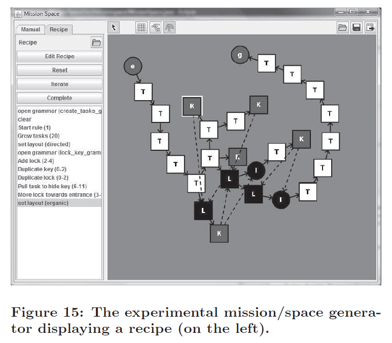
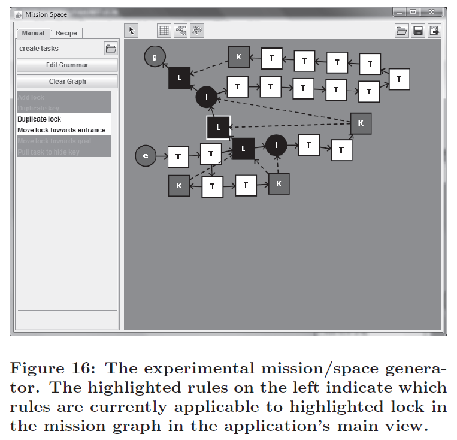

## 6. 自動設計工具 (Automated design tools)
上述所討論的技術，對自動化建立關卡設計工具有影響力。這些工具有幾種方法：一種是可以嘗試建立一個從頭開始完整生成關卡的工具，或是另一種，可以嘗試協助設計師採用**人機交互主導 (mixed-initiative)**方式[19][18]的工具。雖然第一種方法本身是有趣的，但實際上完整生成關卡的遊戲，相對較少。而我們感興趣的第二種，專注在協助設計師的工具，已經越來越多遊戲公司意識到這樣的工具，可以有效提升他們員工的產出：它讓關卡設計師專注在工作上的創造性，並將大部分的手動工作讓電腦代替執行。像是那些讓玩家在遊戲中成為共同創造者的遊戲（例如 *Little Big Planet*），就很有機會。

模型轉換和改寫系統對於人機交互主導方法很相配。他們提供設計師許多機會，在不同程度的抽象概念，控制關卡生成的過程。在最高層次的抽象概念中，設計師可以指定轉換的順序，為每個步驟選擇不同的改寫系統。實際上，這讓設計師指定這關卡是否被設計具有特定任務，作為它的起點（如圖1所示），或特定的空間是否引導該關卡的設計（如圖2所示）。甚至可以有替代模組來生成不同類型的空間：一個改寫系統可能產生一個 *dwarf fortress* ，也可能產生一個 *orc lair* 。附帶的轉換可能將 *orc lair* 換成 *dwarf fortress overrun by orcs* 等。為此目的，實驗原型允許設計師指定**配方**：應用於隨機節點的一系列規則。配方可以指定規則被應用的次數、工具被隨機選擇的範圍或指定必須被應用的規則（只要該規則應用於合適的節點）。配方還可以指使工具選擇特定的改寫系統，或更改圖形的布局（參見圖 15）。

在較低層次的抽象概念，設計師也可能影響改寫規則的應用。在原型中，容許圖狀語法的架構和改寫系統，設計師可以在圖形中手動選擇節點，然後應用任何適用的改寫規則。當沒有節點被設計師選擇時，這個工具就會找出哪些規則被適用於所有的節點，並提供給設計師去選擇。當設計師選擇要應用的規則時，會隨機選擇合適的節點（參見圖 16）。

在這種方式，**任務圖 (mission graphs)**會被緩慢的轉換成**空間圖 (space graphs)**，空間圖其中的特點是可以被轉換成地理地圖。該工具實施一個自動布局系統來處理改變的圖示，但設計師可以通過拖移各個節點來手動改變布局。目前，關卡空間代替地圖的翻譯，在俯視的 2D 動作冒險遊戲是非常明確的。**形狀語法 (Shape Grammars)**和塑造改寫系統來推敲出空間的實行，也只能在二維中實施，但同類型的語法可以在三維中執行（如果需要的話）。