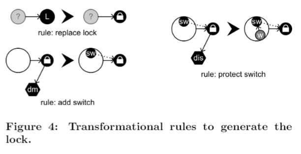

##4.鎖與鑰匙的機制 (LOCK AND KEY MECHANISMS)

鎖和鑰匙機制是任何動作冒險遊戲的核心特徵。鎖與鑰匙的機制被用於通過遊戲建構玩家的進展。一個典型的冒險遊戲有實際的鑰匙用於解鎖門，但也包括許多其他類似鑰匙的功能的物品。舉例來說，一個特殊的魔法劍可以作為一個鑰匙，當需要打敗一個特定的敵人，以便繼續進行遊戲。設計有趣的鎖和鑰匙的機制是設計冒險遊戲的一個重要方面。在許多發行遊戲的成功設計策略中通常圍繞著結合物品與增益道具作為物理模擬，戰鬥系統的鑰匙。這些鑰匙很少僅用於解鎖特定門口的唯一目的; 它們可作為武器或讓玩家可以以新的方式在環境中移動。舉例來說，炸彈可以用於敵人，但也可以用於清除被阻擋的通道。 為了讓玩家創造一個新的體驗，設計師總是在尋找新的和有趣的方式來創建這種類型的機制。

為了這個目的，集成到物理模擬是一個'關鍵特徵'，一般來說，最好通過設計一個系統用於最大化元素之間可能的相互作用的數量來實現集成，而不是通過引入許多不同（類型）的實體。這允許設計師設計需要玩家結合不同項目和/或動作的謎題。

鎖和鑰匙機制已經在**任務/構造(Mission/Frame framework)**中發揮了重要作用[9]。在特定的鎖和鑰匙機制中允許設計者在非線性分支結構（參見 圖1）中轉換線性任務集合。

這些分支結構更適合遊戲空間的生成。在這種情況下，通過執行**變換圖語法(transformation graph grammar)**來實現變換本身。生成整個關卡的過程可以被分解成各自由不同語法描述的一系列變換。然而，在這個先前的報告中，鎖和鑰匙仍然是抽象的結構，我沒有嘗試為他們生成更有趣的物理機制，或者在遊戲中給他們額外的目的。

通過在任務圖中添加描述鎖和鑰匙的任務的屬性，可以生成更詳細的機制和多樣的目的。圖2說明了這一點，屬性被表示為分別連接到鎖與鑰匙的六邊形。在這種情況下，該圖表示弓和箭如何能夠起作用用來打開鎖，需要在一定距離處對其施加傷害。這種情況可以通過創建門來實現，該門由需要被打擊的開關觸發，並且將開關放置在不能穿過但可以被射擊（例如水）的障礙物之後。圖3顯示出了滿足這些要求的空間圖。在該圖中，大圓圈表示關卡中的不同房間或地方，而黑色圓圈表示位於那些地方的物品或特徵。實線箭頭指示玩家如何在地點之間移動。虛線箭頭表示特定開關解鎖門，當實體的箭頭在水與開關之中，表示著開關是受水保護的。圖4表示可以生成構造的轉換規則。

類似的特性，像是造成火屬性傷害，獲取遠距離物品與抗火的能力可用於從一個和另一個之間分離鑰匙，也可以測試一個物品是否可能無意間做為一個為另一個鎖而設計的鑰匙。舉例來說，劍可以被看成一個具有傷害屬性的鑰匙，而弓作為具有損傷屬性以及遠距離屬性的鑰匙。這意味著，一個鎖可能藉由劍或弓造成傷害而打開。在這種情況下，生成一個關卡，令玩家找到弓之前的劍更加有意義。另一個有趣的案例是，將鎖設計成在熔岩後面，必需用弓來觸發。然而，如果同一關卡存在一個物品能讓玩家安全度過熔岩，則玩家就可以不需要弓而通過此區域。在這兩種情況下，轉換不會產生不想要的情況變得很重要。防止系統生成這些情況的最直觀的方法是指定一個**限制(constraints)**來識別他們並使用這些限制來消除在應用他們之前所生成的轉換。
