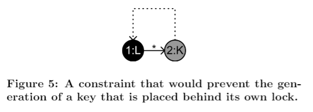
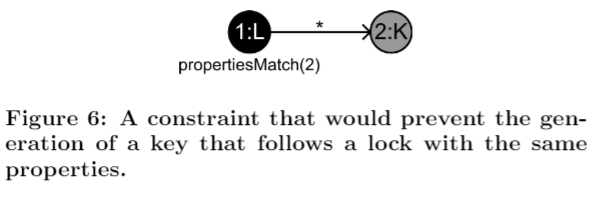

## 5.限制 (Constraints)

在使用傳統的變換語法中，**限制(Constraints)**不是主要的核心。因為傳統的方法是將需要在特定結構還未產生時來建構語法。在許多情況下，這是可行的，但同時也是相當困難的。設計者需要對轉換語法透徹的了解與豐富的經驗。在遊戲產業中，人機互動程序化內容生成的主要目標客群是遊戲設計師。我打算創建一個人機互動程序化內容生成工具來幫助遊戲設計師。對設計師來說，設計一系列的**限制(Constraints)**是比較直觀的，因為只要思考怎樣的語法會產生出不希望出現的結構。為了達到這個目標，我建議在*Ludoscope* 中使用**限制(Constraints)**來擴展轉換語法的實作。

在 *Ludoscope* 中，**限制(Constraints)**被定義的方法與定義規則的方法雷同。依據不應該發生的情況來創建一個圖表來說明。舉例來說，在圖五中的**限制(Constraints)**指出用於特定門的鑰匙不能被放置在它能解鎖的門的後面。在這種情況下，交界箭頭上的星星表示在鎖與其鑰匙之間可能存在任何數量的連接; 換句話說，鑰匙不需要直接跟在鎖的後面。當語法在尋找適當規則的期間，像上述這樣的**限制(Constraints)**可以很容易被檢查出來。 *Ludoscope* 在選擇要應用的規則之前，就已經編譯所有適用規則的列表。如果規則的應用與**限制(Constraints)**的圖符合，則會刪除該列表中的規則。這使得在選擇和應用規則的過程中會隨著過程強度增加而減慢。然而，符合存在的子圖能加快實行並且可以在另外的情況下使用 (另外的情況參見Marlon Etheredge 在同一研討會上提交的論文[10])。此外，在編譯適合規則的列表的同時應用規則和尋找**限制(Constraints)**具有的共同優點是提供一些機會去運行這種會影響到規則的適用性的**啟發法(heuristics)**。例如它可以檢查新圖形的大小，並根據指定的目標大小調整規則選擇的可能性。

以這種方法實現，**限制(Constraints)**的定義可以容易地擴展到包括有用的快捷方式。舉例來說在圖六中**限制(Constraints)**使用特殊命令，該命令詳細說明**限制(Constraints)**只能被應用在其中節點1與節點2具有相同的屬性集合。

每個語法都詳細說明了**限制(Constraints)**，在*Ludoscope*中，語法的執行對應到多步生成過程中的單步變換。這意味著在每個步驟之後，生成的內容應該是連續的且一致。 它還增加了後面步驟的靈活性，能夠打破適用於早期步驟的**限制(Constraints)**。特別是因為在用於內容生成的這種模型驅動架構中，後來的轉換越來越趨向於特定被期望的遊戲。舉例來說，在早期創建遊戲結構的通用轉換中不允許把鑰匙放在鎖後面，這是一個好主意，它等同於讓鑰匙被放置在鎖之後的語法。因為在這個特定的遊戲中，該鎖可以一開始被解鎖然後當玩家通過它時再鎖起來。

