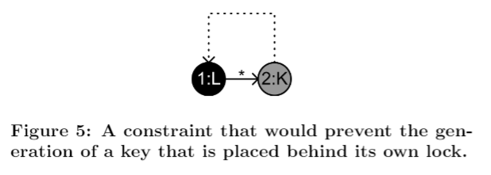
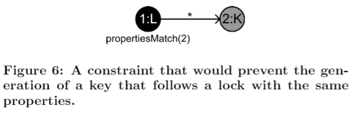

## 5.限制 (Constraints)

在使用傳統的變換語法中，**限制(Constraints)**不是佔主要的一部份。傳統的方法是將需要在特定結構還未產生時來建構語法。在許多情況下，這是可行的，但也是困難的。它需要對轉換語法透徹的了解與豐富的經驗。人機互動的內容生成使遊戲設計師成為重要的目標群體。我計畫創建自動化工具來幫助設計師。對於提出一些**限制(Constraints)**的設計師來說，如何設計出一個不會產生不必要的結構的語法是很直觀的。因為這個原因，我推薦使用**限制(Constraints)**來擴展 *Ludoscope* 中的轉換語法實行。

在 *Ludoscope* 中，**限制(Constraints)**與規則以相似的方法被定義。創建一個圖用來說明不應該發生的情況。舉例來說，在圖5中的**限制(Constraints)**指出用於特定門的鑰匙不能被放置在它解鎖的門後面。在這種情況下，交界箭頭上的星星表示在鎖與其鑰匙之間可能存在任何數量的連接; 此鑰匙不需要直接跟著它的鎖。當語法在尋找適當的規則，像上述這樣的**限制(Constraints)**可以容易檢查出來。 *Ludoscope* 在選擇要應用的規則之前，就已經編譯所有適用規則的列表。如果規則的應用與**限制(Constraints)**的圖符合，則會刪除該列表中的規則。這使得在選擇和應用規則的過程中會隨著過程強度增加而減慢。然而，符合存在的子圖能快速實行並且可以在此情況下使用 (參見Marlon Etheredge 在同一研討會上提交的論文[10])。此外，在編譯適合規則的列表的同時應用規則和尋找**限制(Constraints)**具有的優點是提供一些機會去運行這種會影響到規則的適用性的**啟發法(heuristics)**。例如它可以檢查新圖形的大小，並根據指定的目標大小調整規則選擇的可能性。，

以這種方法實現，**限制(Constraints)**的定義可以容易地擴展到包括有用的快捷方式。舉例來說在圖6中**限制(Constraints)**使用特殊命令，該命令詳細說明**限制(Constraints)**只能被應用在其中節點1具有相同的屬性集合與節點2。

每個語法都詳細說明了**限制(Constraints)**，在*Ludoscope*中，語法的執行對應到多步生成過程中的單步變換。這意味著在每個步驟之後，生成的內容應該是連續的且一致。 它還增加了後面步驟的靈活性，能夠打破適用於早期步驟的**限制(Constraints)**。特別是因為在用於內容生成的這種模型驅動架構中，後來的轉換越來越趨向於特定被期望的遊戲。舉例來說，在早期創建遊戲結構的通用轉換中不允許把鑰匙放在鎖後面，這是一個好主意，它等同於讓鑰匙被放置在鎖之後的語法。因為在這個特定的遊戲中，該鎖可以一開始被解鎖然後當玩家通過它時再鎖起來。

