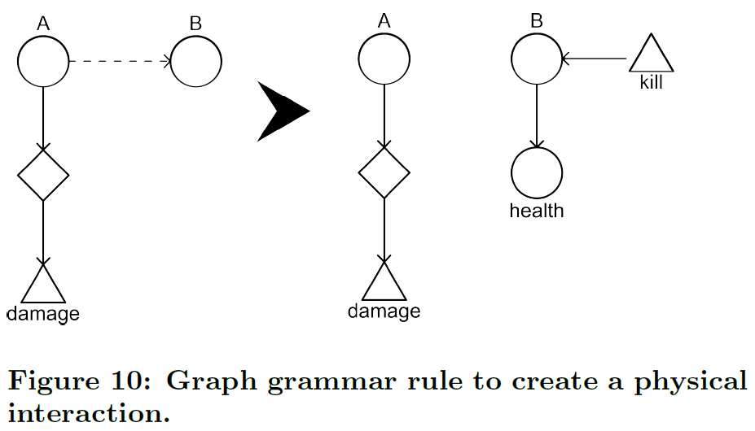

## 實作物理特性 (Implementing the physics)

利用**圖狀語法 (graph grammars)** 的**物理圖表 (physics diagrams)** 來定義出遊戲中的**實體 (entities)** 相當容易，不過要實作或產生與其相關的行為就相當地困難。我建議採用**元件式架構 (component based architecture)** 遊戲引擎，來完成這項艱困的挑戰。而且**元件式架構 (component based architecture)** 越來越受歡迎。這樣便能夠有效地處理各式各樣、不同行為的**遊戲物件 (game object)** [18]。相對於元件式架構的另一種選擇是繼承式架構，而後者較不適合處理不同類型的遊戲實體或遊戲物件的共用行為，而共用行為遵循了軟體工程的**組合模式 (composite pattern)** [12]。

元件式架構有兩項核心類別，分別為**元件 (Components)** 與**複合元件 (Composites)**（備註一），其中複合元件涵蓋了元件。不管怎樣，由於複合元件是從元件繼承而來，所以其它的複合元件也可以涵蓋之（參見圖九）。這讓彈性的巢狀架構能緊密地契合上述之物理圖表，而物理圖表中的遊戲實體能夠被其它的實體所涵蓋。在元件式架構中，遊戲物件並不如同其組織方式來定義，遊戲物件是透過了許多元件來創建，而這些元件定義了遊戲物件的行為，但很少去定義元件本身的行為。


> 備註一：雖然更嚴謹的實作模式會是有三種類型，分別為：元件、複合元件 與分支 (Leaf)，其中元件是**抽象類別 (abstract class)**。

在元件式架構中，個別的元件間不會直接進行通信，而是透過訊息系統來通信。在任一元件都能夠發送與接收任何自定義訊息的情形下，透過 handleMessage 函數來實現該功能。複合元件類別覆寫了 handleMessage 函數，為了也能夠將所有訊息傳遞給它的元件。這樣的方式良好地將物理圖表中的動作給聯繫在一塊。

為了在元件式遊戲引擎中產生物理特性，能夠以兩種不同的方法達成。首先是第一個策略，遊戲物件可以由特定遊戲之中，其預先設計好的元件所構成。如果在這樣的情形下，您想要實體 A 與另一個實體 B 進行互動，您可以在實體 B 添加能夠響應實體 A 啟動的元件，反之亦然。**轉換語法 (transformational grammars)**應用於此情況。圖十說明會造成損傷的實體及另一被添加生命元件的（包含了圖八中定義的所有行為）實體之間的關係。此規則使用虛線箭頭來表示未指定的關係。注意，本規則還強制實體 B 必須響應死亡的動作。



第二個策略對遊戲實體或使用了**生成語法 (generative grammar)** 的元件生成定義，然後生成能夠實現該行為的程式碼。例如圖八中的生命實體，能夠很容易地轉換為以下的程式碼：

```
public class Health implements Component
{
  private hp:int = 3;

  @Override
  public void handleMessage(message:String)
  {
    if (message.equals("damage")) hp--;
    if (message.equals("heal")) hp++;
    super.handleMessage(message);
  }

  @Override
  public void update() //called every frame
  {
    if (hp==0) parent.handleMessage("kill");
    super.update();
  }
}
```

採用策略二，首先能夠產生物理網絡，並從中萃取出元件。這樣便可利用預期數量的交互作用與**反饋循環 (feedback loops)** 來產生出物理網絡。

